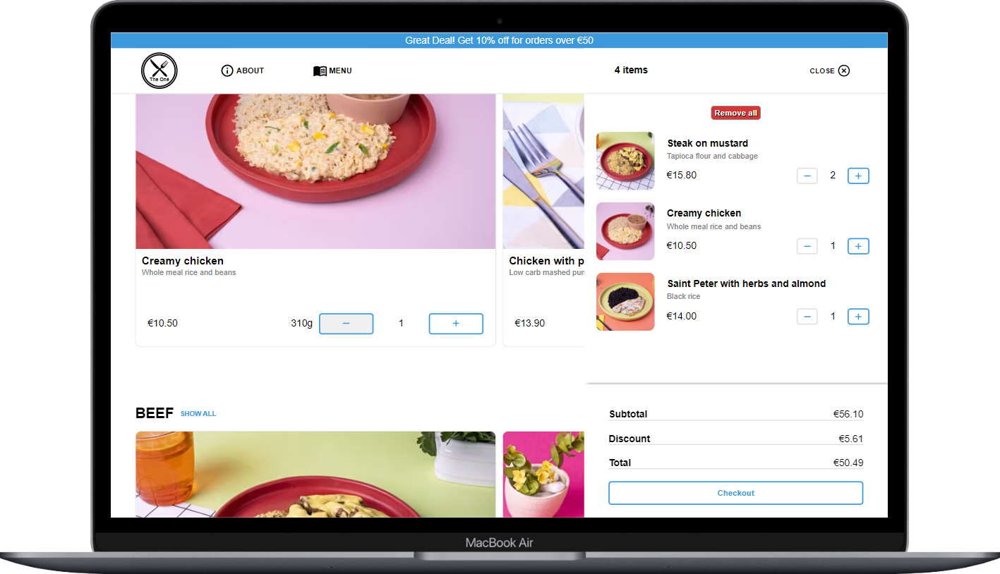

# Food-Ecommerce



### This project was bootstrapped with [Vite](https://vitejs.dev/guide/).

## 💻 Project

A Full-Stack e-commerce that allows users to create authenticated accounts, manage cart items, execute card payments, and keep track of their order history.

## 🚀 Stack & Tools Used:
- React.js
- Redux
- Local Storage
- Material UI
- Firebase
- Express
- Stripe API

## How to use?

#### Download this repository

#### Create a .env file and add the following keys to it:
```bash
VITE_FIREBASE_API_KEY = your_own_key
VITE_STRIPE_PUBLISHABLE_KEY = your_own_key
```
(replace the values from the keys above with your own)


### In the project directory, run the following commands:
##### To install dependencies and node_modules:
```bash
npm install
```

##### To start the application:

```bash
npm run dev
```
##### To see a live demo of this project, click [here](https://theone-ecommerce.netlify.app/)

### Author
- Michel Pomerantzeff
